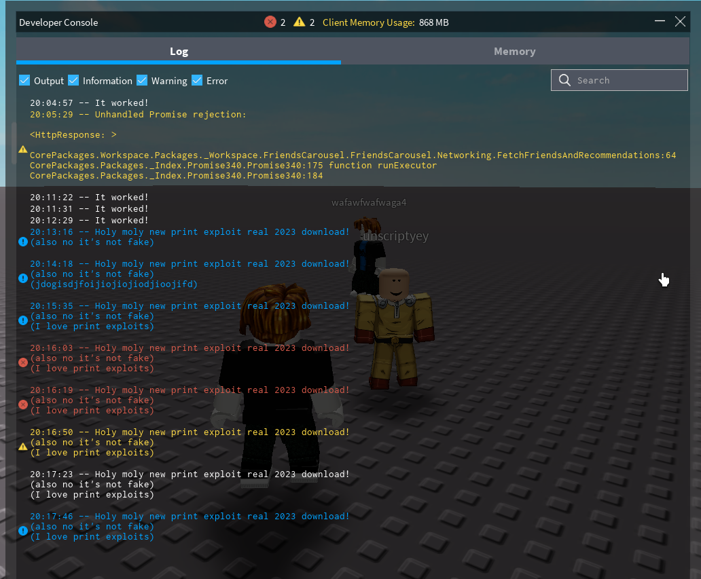

# printsploit

> ![IMPORTANT]
> Because Fluster has been discontinued, and no longer works (even with the upgrade required prompt bypass), this repository will no longer be updated (however, the repository won't be archived, unless I feel like so).

Funny print exploit

